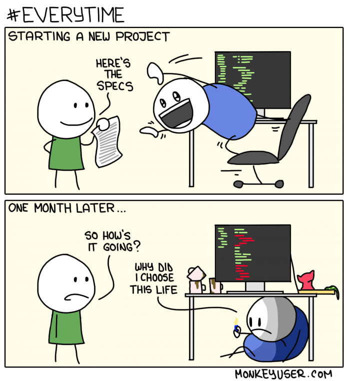
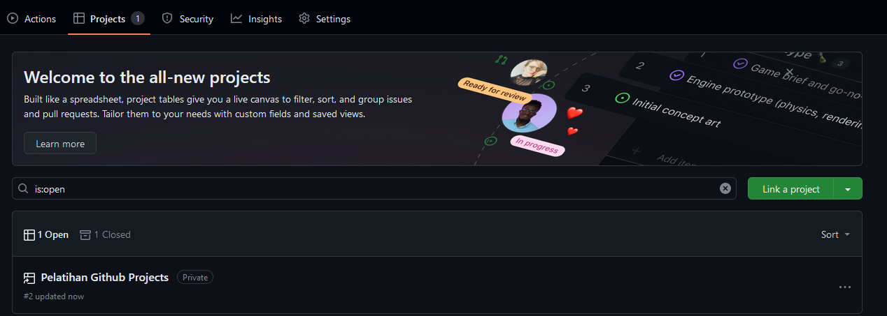
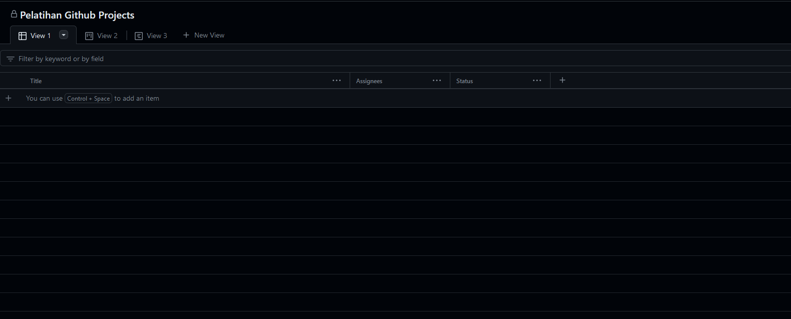
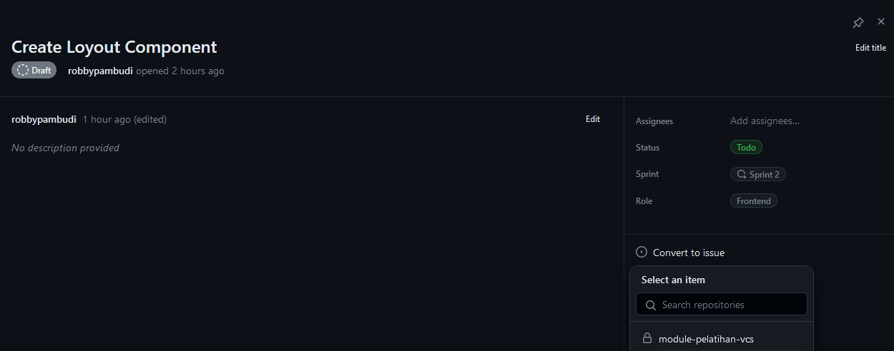

# Github Projects

Untuk menghindari kekacauan sebagaimana yang tampak dalam gambar di atas, sebagai seorang developer yang bertanggung jawab, kita perlu menjalankan proyek dengan pendekatan yang teratur dan terarah. Mengelola proyek dengan baik bukanlah tugas ringan.

Pertama-tama, perlu merancang **rencana** proyek yang komprehensif sebelum meluncurkan kode ke dunia (Deploy). Layaknya menyiapkan peralatan sebelum petualangan besar, rencana tersebut harus mencakup langkah-langkah yang jelas dan waktu yang diperlukan untuk menyelesaikan proyek. Rencana tersebut juga harus mencakup bagaimana cara mengukur keberhasilan proyek.

Oleh sebab itu untuk meningkatkan keberhasilan dalam project yang sedang dijalankan, perlu sebuah alat yang dapat membantu dalam mengelola project tersebut. Alat tersebut adalah **Github Projects**.

## Macam - Macam Tools Project Management
Ada banyak tools yang dapat digunakan untuk mengelola project, seperti:
  - Non Developer
    - Spreadsheet (Excel, Google Sheet)
    - Miro (https://miro.com/)
    - Figma (https://www.figma.com/)
  - Developer
    - Github Projects
    - Trello (https://trello.com/)
    - Jira (https://www.atlassian.com/software/jira)
    - Dll.

## Kenapa Github Projects?
Alasan utama untuk menggunakan **Github Projects** adalah karena Github Projects terintegrasi dengan Github. Sehingga kita dapat mengelola project dan kode dalam satu tempat. Selain itu, Github Project ini cocok digunakan untuk project yang bersekala kecil hingga menengah. Jika project yang sedang dikerjakan berskala besar, maka disarankan untuk menggunakan tools lain yang lebih lengkap seperti (Confleunce, Jira, dll).

## Cara Menggunakan Github Projects
Untuk menggunakan Github Projects, kita perlu membuat sebuah repository terlebih dahulu. Setelah itu, kita dapat membuat sebuah project baru dengan cara klik tab **Projects** pada repository yang telah kita buat.

Jika sudah membuat project baru, maka kita bisa masuk kedalam project tersebut. 

> **Note:** Bisa menggunakan template yang telah disediakan oleh Labolatorium Rekayasa Perangkat Lunak (RPL) untuk mempermudah dalam membuat project baru. Template tersebut dapat diakses melalui link berikut: 
> https://github.com/orgs/Lab-RPL-ITS/projects/2

<video src="level-4/template.mp4" controls title="Template Github Project"></video>

### Convert Task List to Issue
Setelah membuat project baru, kita bisa menyambungkan project tersebut dengan repository yang telah kita buat sebelumnya. Caranya adalah dengan mengklik **Card** yang ada pada project tersebut, lalu klik **Convert to Issue**.

Akhirnya, kita bisa melihat issue yang telah dibuat pada repository yang telah kita buat sebelumnya. 

