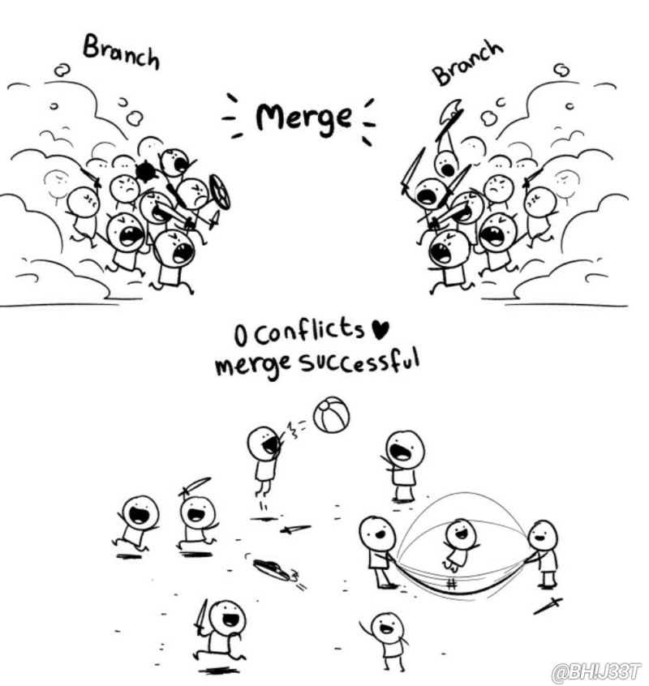

# Dasar Teori

## Pengenalan Version Control System 

### Apa itu Version Control?

Alice baru saja mendapat tugas membuat modul mengenai version control system untuk
mahasiswa baru. Tentu saja, membuat modul bukanlah pekerjaan yang selesai dalam
sekali duduk. Di pendahuluan, Alice menjelaskan kegunaan dan macam-macam version
control system yang tersedia. Beberapa hari kemudian setelah Alice menulis beberapa
bab pada modul, dia ingin membuat modulnya lebih to-the-point, sehingga pendahuluan
tadi dihapus untuk mempersingkat. Ketika modul hampir selesai ditulis, Alice
tiba-tiba menyesal dan ingin mengembalikan pendahuluan yang sebelumnya dihapus. 
Apa boleh buat 😞☝️

Agar kejadian ini tidak terulang lagi, Alice memutuskan untuk menyimpan
perubahan-perubahan yang terjadi dalam pembuatan modul, sehingga Alice bisa mengembalikan
versi modul ke waktu tertentu atau mengembalikan tulisan yang dihapus pada saat tertentu. 

Pada versi 6, Alice menghapus suatu bagian dalam modul. Apabila di kemudian hari Alice
tidak jadi ingin menghapus bagian ini, maka Alice cukup melihat versi modul sebelum
bagian tersebut dihapus.

Kamu baru saja mempelajari konsep version control. Version control pada kasus ini
diterapkan agar penulis dapat melihat kondisi tulisan pada banyak versi yang dibuat
pada waktu yang berbeda-beda. 

Version control bisa saja diterapkan pada suatu literatur, namun bidang lain yang
cocok untuk diterapkan version control adalah pemrograman. Bayangkan jika kamu
ditugaskan untuk membuat website toko online. Kamu mungkin akan memulai pembuatan
website dengan membuat skema database, membuat sistem registrasi dan login, fitur
menambah dan mengedit barang jualan, fitur melihat dan membeli barang, dan seterusnya.
Setiap fitur sendiri pun sebenarnya bisa dipecah menjadi tugas-tugas yang lebih kecil.
Version control system dapat membantu kamu sebagai programmer untuk melacak setiap
perkembangan dalam pengembangan website yang ingin dibuat.

Tentu saja, pengembangan website tidak akan semulus itu. Ketika mengerjakan fitur
penambahan barang, bisa saja kamu ingin merubah sistem registrasi yang sebelumnya
telah kamu buat. Ketika mengerjakan fitur pembelian, bisa saja kamu menemukan masalah
fatal pada sistem penambahan barang. Ketika kamu ingin menambahkan sesuatu pada sistem
tertentu, bisa saja hal tersebut malah membuat website menjadi tidak stabil. Version
control system membatu programmer untuk menyelesaikan permasalahan seperti ini. Bayangkan
saja jika kamu menggunakan metode version control dengan seperti Alice dengan modulnya,
atau tidak menggunakan metode version control sama sekali, tentu saja kamu akan sangat
kesulitan apabila menemui masalah-masalah di atas.

### Version Control System untuk Kolaborasi

Dalam banyak kasus, pembuatan suatu perangkat lunak tidak dikerjakan dan diselesaikan
oleh satu orang saja. Kali ini, Alice kembali ditugaskan untuk menulis modul mengenai
software testing. Karena materinya lebih banyak, maka Bob dan Charlie ditugaskan untuk
membantu Alice dalam penyusunan modul. Mengacu pada contoh sebelumnya, bagaimana
kelihatannya jika version control dilakukan secara manual?

Dari sini sudah bisa terlihat bagaimana metode tersebut dapat menyebabkan potensi
masalah, bukan? Bayangkan saja jika metode serupa diterapkan pada pembuatan perangkat
lunak, di mana terdapat banyak fitur yang dapat dikerjakan secara paralel dan banyak
developer yang bekerja untuk membangun satu fitur, sehingga beberapa pekerjaan bisa
dikerjakan secara paralel, sedangkan beberapa pekerjaan hanya bisa dikerjakan ketika
pekerjaan sebelumnya selesai.

Dalam kasus pengembangan perangkat lunak (dan tidak jarang literatur, seperti modul ini),
terdapat berbagai macam perangkat lunak yang dapat membantu kita untuk mengelola dan
mengontrol versi pekerjaan dengan efisien.

### Berbagai Software Version Control System

Masalah terkait version control sebenarnya adalah masalah yang klasik dan populer,
sangat populer sampai-sampai terdapat banyak solusi yang ditawarkan untuk memecahkan
inti masalah yang sama.

Software-software ini tentu memiliki perbedaan satu sama lain. Sebagai contoh, SVN dan
VCS adalah version control system yang bekerja secara tersentral, di mana semua pekerjaan
disimpan di satu tempat, dan setiap perubahan yang terjadi ditulis langsung pada tempat
tersebut. Git dan Mercurial memiliki pendekatan yang berlawanan, di mana pekerjaan disimpan
secara terdistribusi, sehingga developer dapat "mengambil" keseluruhan proyek saat ini,
menulis perubahan secara offline, dan "mengumpulkan" kembali hasil pekerjaannya ketika
sudah selesai.

Dalam banyak kasus, kita tidak perlu memusingkan harus memilih version control system apa
untuk proyek tertentu. Git adalah version control system yang paling populer di kalangan
developer dan dapat memenuhi sebagian besar kebutuhan developer terkait version control,
sehingga kita akan membahas Git sebagai version control system.

## Git

### Git sebagai Version Control System

Git adalah salah satu dari banyak version control system yang tersedia di pasaran.
Git awalnya dibuat oleh Linus Torvalds untuk membantu pengembangan kernel Linux.
Git melacak perubahan-perubahan yang terjadi pada source code ketika fitur baru
ditambahkan oleh developer. 

Mengapa menggunakan Git? Git sebelumnya dijelaskan sebagai alat untuk mempermudah
manajemen source code, tapi apa saja yang ditawarkan oleh Git?

* Model terdistribusi
* Dukungan kolaborasi antar developer
* Gratis dan open source
* Pelacakan perubahan pada source code dilakukan secara efisien
* Meningkatkan produktivitas dan efisiensi pekerjaan
* Populer dan memiliki komunitas serta dukungan yang besar

Untuk memahami cara kerja Git, penting bagi developer untuk mengetahui istilah-istilah
yang sering digunakan dalam Git.

#### Repository

Repository adalah tempat Git melacak perubahan. Umumnya, suatu repository berisi
direktori kerja suatu proyek pengembangan perangkat lunak. Misalnya, ketika kita ingin
membangun aplikasi berbasis web, maka repository berisi seluruh file dan folder yang
diperlukan untuk membangun web tersebut. Git tidak memiliki "opini" mengenai apa saja
yang perlu dimasukkan ke dalam satu repository. Pada konteks web, beberapa developer
mungkin membuat repository sendiri untuk frontend, backend, dan mungkin service lainnya
sedangkan beberapa developer mungkin akan menggabungkan semuanya menjadi satu
repository besar.

#### Commit

Commit adalah perubahan-perubahan pada file yang telah disimpan di repository. Ketika
membangun suatu perangkat lunak, tentu saja produk akhir tidak akan selesai dalam
satu kali pengerjaan. Umumnya, seorang developer mungkin akan membuat atau mengubah
beberapa file untuk membangun suatu fitur atau bagian dari fitur. Proses inkremental
seperti ini dapat "direkam" dengan fitur pada commit. Setiap developer yang memiliki
akses terhadap repository kemudian dapat meilihat sejarah atau timeline commit yang
dilakukan selama project berlangsung.

Commit juga menyimpan perubahan-perubahan apa saja yang terjadi pada file (termasuk
penambahan dan penghapusan file), metadata mengenai perubahan (seperti, perubahan
apa yang dilakukan dan mengapa ia dilakukan), siapa yang melakukannya, dan kapan
commit dilakukan.

Git bekerja secara efisien, yaitu dengan menyimpan perubahan-perubahan yang terjadi
terhadap file relatif dari commit sebelumnya, ketimbang menyimpan versi lama (secara utuh)
dan versi baru dari file yang dimodifikasi. Hal ini menyebabkan commit pada Git sangat
bergantung pada commit-commit yang terjadi sebelumnya, dengan keuntungan penyimpanan
yang diperlukan menjadi jauh lebih sedikit jika dibandingkan dengan contoh modul di awal.

Git memanfaatkan algoritma dynamic programming untuk melacak perubahan pada commit
secara efisien. Detail lebih lanjut mengenai algoritma dibaliknya akan kami serahkan
ke rekan-rekan [Lab Algoritma dan Pemrograman ITS](https://github.com/Algoritma-dan-Pemrograman-ITS).

#### Revert

Misalkan seorang developer melakukan commit pada repository yang menyebabkan terjadinya
bug yang fatal pada program ketika dijalankan. Developer dapat melakukan "undo" dan
mengembalikan state repository menuju ke commit terakhir yang tidak menyebabkan bug.
Terdapat beberapa strategi untuk mencapai hal ini, dan fungsi revert pada Git adalah
salah satu cara untuk menggapainya.

#### Clone

Git clone pada dasarnya bekerja seperti download atau copy-paste pada repository.
Ingat model terdistribusi dari Git? Keistimewaan dari Git adalah, developer dapat
menyalin suatu repository dari suatu server pusat (juga disebut remote repository atau
upstream), bekerja dengan kode secara offline, dan menyinkronkan repository lokal dengan
server pusat secara berkala atau ketika terdapat perubahan yang ingin disinkronkan.

#### Pull dan Push

Pull dan push adalah fitur untuk menyinkronkan perubahan pada repository lokal dan pusat.
Pull, ketika dijalankan, secara sederhana akan menanyakan server pusat "apakah terdapat
commit baru atau perubahan lain yang terjadi sejak terakhir saya menyinkronkan repository
lokal dengan pusat?". Jika terdapat perubahan, maka perubahan tersebut akan disinkronkan
dengan repository pusat. 

Push bekerja secara berlawanan dengan pull. Jika pull berfungsi untuk "menarik" perubahan
dari server pusat ke repository lokal, maka push bekerja dengan memberitahu server pusat
"saya punya commit baru di repository lokal, tolong sinkronkan commit ini dengan server
pusat sehingga developer lain dapat melihat pekerjaan saya".

#### Branch

Dalam suatu project besar di mana terdapat beberapa developer yang bekerja untuk
membangun suatu fitur, akan sangat membantu jika developer tersebut dapat berfokus
pada pekerjaannya sendiri tanpa terganggu dengan commit dari developer yang membangun
fitur lain.

Fitur branch pada Git memungkinkan developer untuk menyimpan snapshot dari kondisi
repository pada saat tertentu, sehingga developer dapat bekerja pada fitur tertentu
tanpa distraksi. Selain itu, branch juga memungkinkan developer untuk mengerjakan
suatu fitur secara terisolir tanpa mengganggu branch utama (atau branch lain),
sehingga jika terdapat suatu kesalahan pada branch, developer dapat me-revert branch
tersebut tanpa khawatir akan berdampak pada branch lain. Apabila ternyata di kemudian
hari ditemukan bahwa fitur yang sedang dikerjakan ternyata tidak diperlukan atau rusak,
branch dapat dihapus dengan aman tanpa mengganggu branch lain.

Sebagai contoh, jika mengacu pada contoh modul di awal, Alice, Bob, dan Charlie mungkin
mendapat pembagian bab yang perlu ditulis. Pada kasus ini, mereka dapat membuat setiap
bab sebagai branch-nya sendiri. Apabila ternyata suatu bab tidak diperlukan atau dalam
pengerjaannya terdapat kesalahan, commit pada branch tersebut dapat di-revert secara
independen dan branch dapat dihapus tanpa mengganggu pengerjaan bab lain. 

#### Checkout

Misalkan alice mengerjakan bab 1 pada branch bab-1 dan Bob mengerjakan bab 2 pada branch
bab-2, bagaimana cara Alice dapat melakukan revisi pada bab 2, jika ia bekerja pada branch
bab-1? Git checkout memungkinkan Alice untuk "berpindah" ke branch bab-2 dan melakukan
commit pada branch tersebut.

Dalam pengembangan perangkat lunak, suatu developer bisa saja bekerja pada beberapa
branch. Git checkout memungkinkan developer untuk mencapai hal ini.

#### Merge

Sebelumnya dijelaskan bahwa branch pada Git memungkinkan developer untuk bekerja pada
suatu fitur secara terisolir dari branch utama (atau branch lainnya). Namun, bagaimana
jika fitur yang dikerjakan sudah selesai dan ingin diintegrasikan pada branch utama? 

Merging pada Git adalah proses untuk menggabungkan perubahan-perubahan yang terjadi
pada suatu branch ke branch lainnya (tidak mesti ke branch utama). Menggunakan perumpamaan
penyusunan modul sebelumnya, dapat diibaratkan bahwa branch adalah file dokumen modul yang
dikerjakan Alice, Bob, dan Charlie secara individu, sedangkan merging adalah proses
menggabungkan dokumen-dokumen tersebut menjadi satu.

#### Conflict

Katakanlah modul bab 1, 2, dan 3 sudah selesai dikerjakan. Kali ini, Alice ditugaskan
untuk mengerjakan bab 4 dan Bob ditugaskan untuk mengerjakan bab 5. Mereka kemudian membuat
branch masing-masing. Di tengah pengerjaan, Alice dan Bob mempunyai ide "cemerlang" untuk
merevisi bab 3, sehingga branch mereka masing-masing mengandung commit yang merubah bab 3.
Kebetulan, mereka melakukan revisi pada bagian yang sama pada bab 3, dan tulisan mereka
sangat berbeda satu sama lain. Ketika branch bab 4 dan bab 5 kemudian di-merge, Git bisa
saja "bingung" dan tidak bisa memprioritaskan commit siapa yang pada akhirnya diperbolehkan
mengubah bab 3. Situasi inilah yang disebut conflict.

Conflict adalah konsep yang agak sulit dijelaskan secara tekstual dan dapat lebih mudah
dimengerti ketika seorang developer sudah mengalaminya secara langsung. Look forward to it 😉.

### Git Workflow

Untuk memberikan gambaran bagaimana Git bekerja, berikut bagan siklus kerja dalam Git:

Pada Git, kita akan melakukan pengaturan (setup) awal projek kita kemudian tiap developer
akan melakukan checkout terhadap branch (cabang) masing-masing dan mulai mengerjakan tugasnya.
Developer akan melakukan perubahan terhadap projek terkait kemudian memasukkan (add)
perubahan-perubahan yang telah dibuat kedalam staging area yang selanjutnya akan dilakukan
permanen snapshot (commit) terhadap perubahan yang telah dimasukkan ke staging area pada
local repository. Setelah itu, dilakukan push untuk memperbarui kumpulan snapshot pada
remote repository.

## GitHub

Git awalnya dibuat untuk mengelola kode sumber pada proyek pembuatan kernel Linux.
Seperti yang kita ketahui, development kernel Linux melibatkan banyak developer.
Oleh karena itu, Git dibuat sehingga dapat menangani workflow yang bersifat kolaboratif.
Meskipun demikian, mengelola server Git agar dapat digunakan oleh banyak orang membutuhkan
server yang aktif 24/7. Selain itu, apabila server ini rusak karena hal tertentu, maka
repository pada server pusat punya potensi untuk hilang selamanya. Tidak hanya itu, Git
server bekerja pada protokol SSH yang mungkin sulit untuk dikonfigurasi developer pemula.
Bahkan ketika kita mempunyai akun SSH untuk mengakses server Git yang dikelola secara
mandiri, kita hanya dapat melihat repository yang kita punya sendiri.

Sekarang, bayangkan jika kita dapat "menitipkan" repository kita pada server yang
dikelola secara profesional, dapat menyala 24/7, memiliki backup sehingga repository
kita tetap aman jika terdapat kejadian tidak terduga seperti bencana alam pada lokasi
server berada, mempunyai interface yang lebih ramah pengguna, dan dapat diakses oleh
semua orang secara gratis, sehingga kita bisa melihat repository publik dari developer
lain dan mempelajari kode sumber tersebut dan bahkan berkontribusi pada proyek open source?
Kurang lebih begitulah ide dasar dari GitHub.

GitHub dapat diibaratkan sebagai "media sosial"-nya Git. Dengan akun GitHub, kita dapat
menitipkan repository ke server GitHub sehingga orang lain dapat mengakses repository
kita dan membuat commit, branch, dan melakukan perubahan lainnya. Pada dasarnya, repository
yang di-hosting di Git dapat bertindak layaknya remote repository. Interface yang ditawarkan
Git juga sangat user-friendly. Sebagai contoh, jika dengan Git kita memerlukan CLI untuk
melihat status commit, berpindah branch, hingga melihat daftar perubahan, GitHub menyediakan
interface berbasis web (dan aplikasi!) yang lebih mudah digunakan seperti ini:

 

Karena sudah banyak developer yang tergabung dengan GitHub, komunitas yang besar ini
juga berarti kita memiliki akses terhadap ratusan juta repository yang di-hosting
(atau di-mirror) di GitHub, seperti MySQL, GCC, hingga Linux kernel. Hal ini menjadikan
GitHub sebagai platform yang menarik bagi developer untuk melakukan pengembangan perangkan
lunak berbasis Git secara kolaboratif, mulai dari skala kecil seperti tugas kelompok,
hingga proyek berskala besar seperti pembuatan compiler.

Sebenarnya masih banyak lagi fitur yang ditawarkan oleh GitHub untuk membantu developer
berkolaborasi, seperti fitur pull request, code review, issue tracker, hingga fitur yang
membantu deployment, seperti GitHub Actions. Seluruh fitur ini tentu saja tidak dapat
diajarkan dalam satu kali pelatihan, sehingga kita akan berfokus pada fitur inti saja.

Sama seperti Git, GitHub juga mempunyai kompetitor, seperti GitLab, BitBucket, Gitea,
dan Gogs. Dewasa ini, agak jarang ditemui developer yang menggunakan beberapa version
control system sekaligus (seperti, misalnya, Git dan Mercurial). Namun, developer yang
menggunakan GitHub, GitLab, dan Gitea sekaligus masih sering ditemui, terutama pada
korporat. Kita akan berfokus pada GitHub karena layanan ini paling populer sehingga
terdapat banyak sumber belajar yang bisa ditemui. Meskipun begitu, pengetahuan ini
umumnya bersifat transferable. Apabila developer sudah familiar dengan GitHub, maka
mereka tidak akan kesulitan untuk beradaptasi dan menggunakan GitLab dan sebaliknya.
