# Simulasi GitHub Dasar

Setelah mengenal Git dan GitHub dari teorinya, sekarang kita akan mengenal GitHub lebih dalam.

## Membuat Akun
Berikut langkah pembuatan akun GitHub
  
  1. Pilih Sign Up untuk mendaftarkan diri menjadi pengguna baru GitHub

2. Isi semua data yang diperlukan untuk registrasi seperti email, password dan lain sebagainya
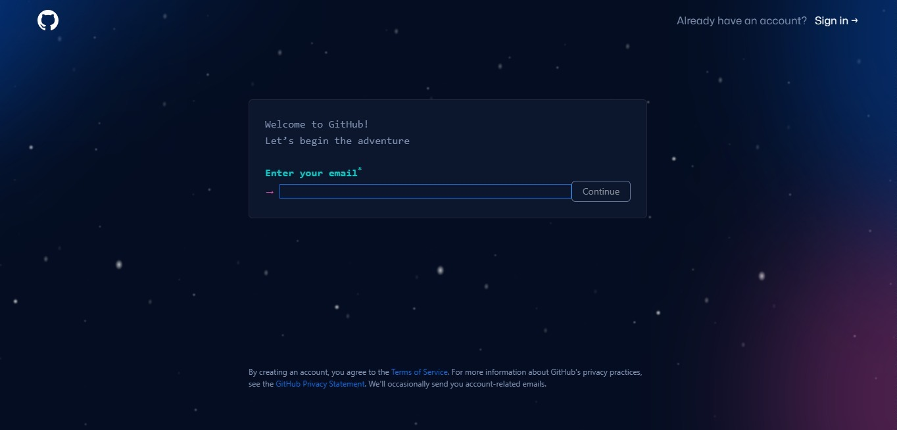

3. Lakukan personalisasi atau lakukan skip jika tidak ingin melakukan personalisasi

4. Selamat ! Kamu telah berhasil membuat akun GitHub mu!

## Inisiasi Repository

Setelah membuat akun GitHub, mari kita membuat repository pertama

### Membuat Repository
Berikut tahapan membuat repository pada github

1. Klik tanda `+` 
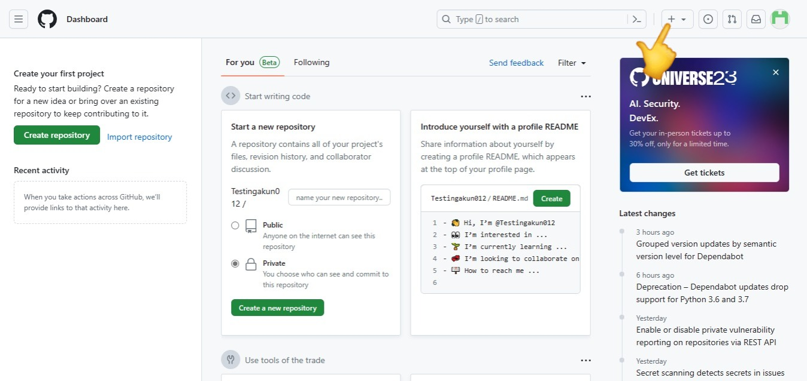

2. Pilih `New Repository`
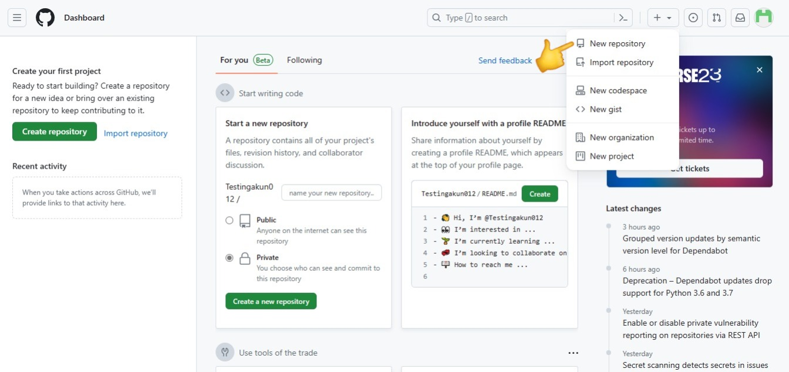

3. Isi kelengkapan repository seperti nama repository, deskripsi, sifat repository (public/private), penambahan README.md dan lain sebagainya
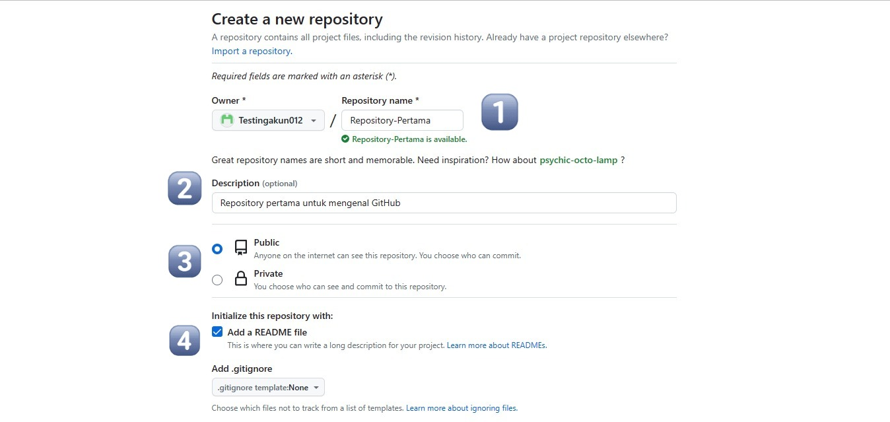

4. Selamat ! Kamu telah berhasil membuat repository pertamamu !

## Manajemen File

Pada GitHub, kita dapat memanejemensi file yang ada dengan berbagai fitur, berikut fitur-fitur yang ada pada GitHub

### Memasukkan File dari GitHub
Kita dapat memasukkan file dengan dua cara
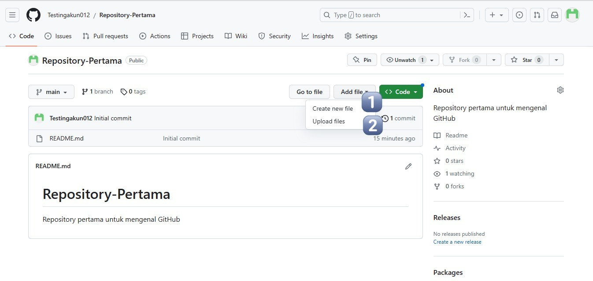

1. Cara Pertama adalah dengan membuat file barunya secara langsung
   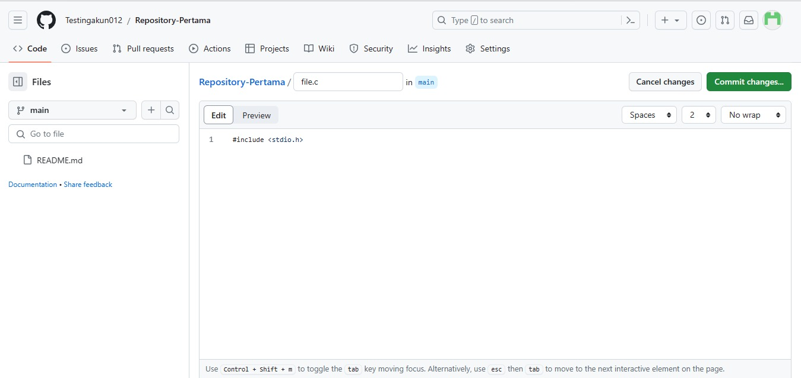

2. Cara Kedua adalah dengan meng-*upload* file
    

### Melakukan Commit
Setelah file yang diinginkan sudah ditambahkan, file dapat dicommit.

1. Commit pada cara pertama
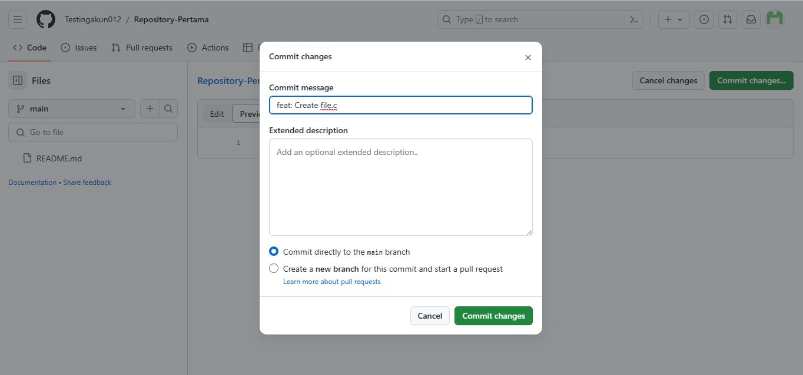

2. Commit pada cara kedua
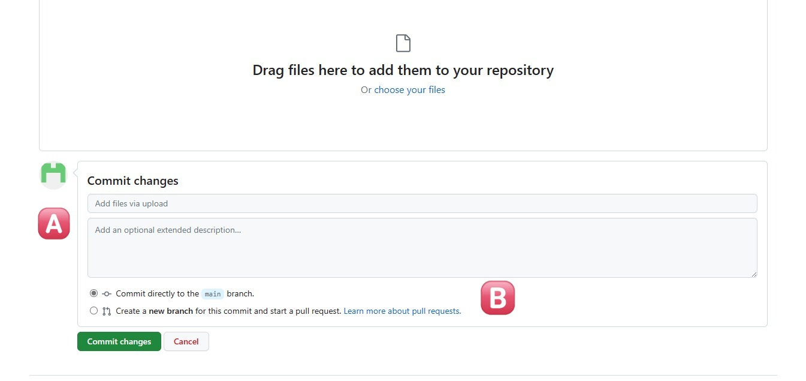

Pada tiap cara di atas, terdapat bagian commit seperti judul dan deskripsi (A) serta pilihan tipe commit (B). Pada pilihan tipe commit, terdapat dua pilihan, langsung menggabungkan ke main atau dicommit menuju branch lain terlebih dahulu. Branch akan dijelaskan di bagian selanjutnya pada materi ini.

Jika file telah dipermanen di github, maka anda dapat melihat judul commit anda pada bagian ini
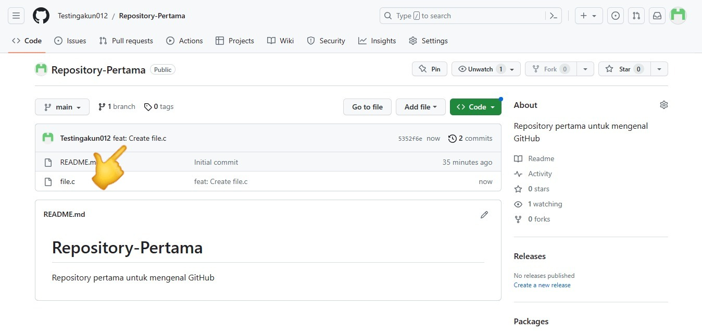

### Conventional Commit 
Conventional Commit adalah cara penulisan pesan commit yang banyak digunakan oleh para *developer*. Berikut contohnya,
- `feat` Commits, menambahkan fitur baru
- `fix` Commits, memperbaiki bug
- `style` Commits, menambahan perubahan yang tidak berefek terhadap arti dari kode
- `test` Commits, menambahkan test yang belum dibuat maupun memperbaiki test yang telah ada sebelumnya

Selengkapnya dapat dilihat pada 

https://www.droidcon.com/2023/03/03/code-commit-guidelines-using-conventional-commits

### Mengedit File
Jika ditemui kesalahan pada file yang telah dicommit, file dapat diedit supaya revisi dapat dilakukan.

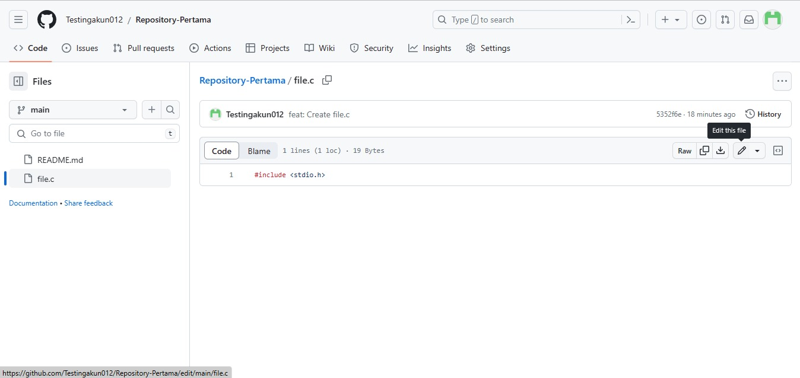

Hasil dari file yang telah diedit kemudian dicommit kembali agar hasilnya dapat permanen di github.

### Membuat Branch
Branch dapat dibuat dengan berbagai cara, berikut beberapa cara-cara pembuatan branch

1. Langsung dari halaman utama repository
   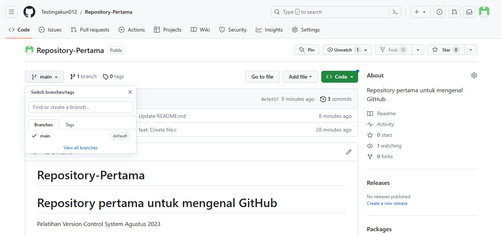
2. Melalui create new file
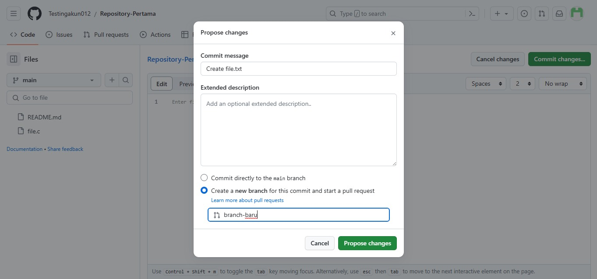
3. Melalui upload file
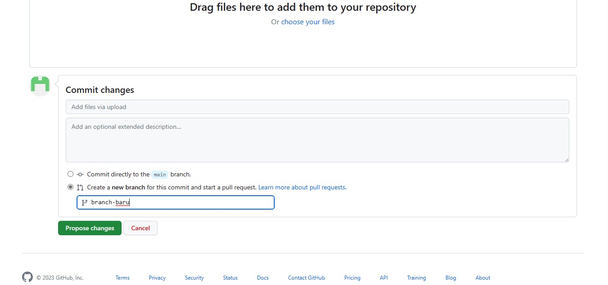

Branch sendiri berguna sebagai sarana pengembangan fitur maupun perubahan pada lingkungan yang berbeda dari main sehingga perubahan yang kita lakukan tidak akan mengganggu main maupun mengganggu orang lain yang juga sedang bekerja pada projek yang sama

### Melakukan Pull Request
Pull Request merupakan fitur pada GitHub yang membantu *developer* untuk memberitakan bahwa telah dibuat perubahan dan *contributor* lain dapat melakukan review terhadap perubahan-perubahan tersebut sebelum dilakukan Merge ke main 

berikut tampilan Pull Request,
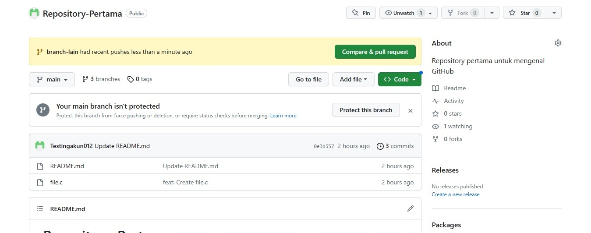
Tampilan ketika branch siap di Pull Request (Ada Perubahan)
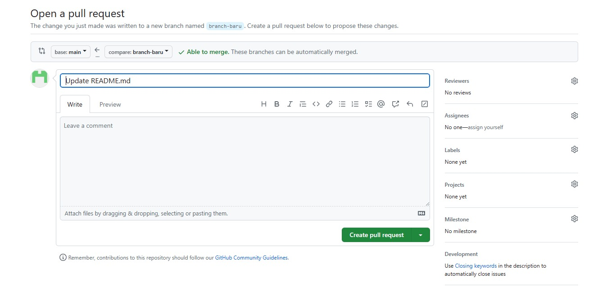
Tampilan ketika branch akan di Pull Request, terdapat berbagai kelengkapan seperti judul dan deskripsi yang dapat diisi.
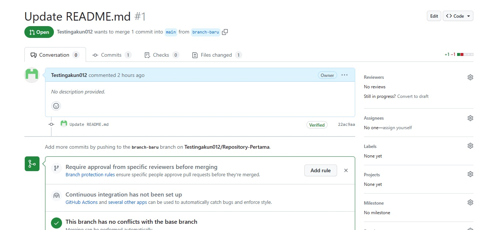
Tampilan Pull Request ketika telah dibuat

### Melakukan Merge
Ketika Pull Request telah selesai di-*review* maka saatnya melakukan merge terhadap branch. Berikut tiga macam merge yang tersedia

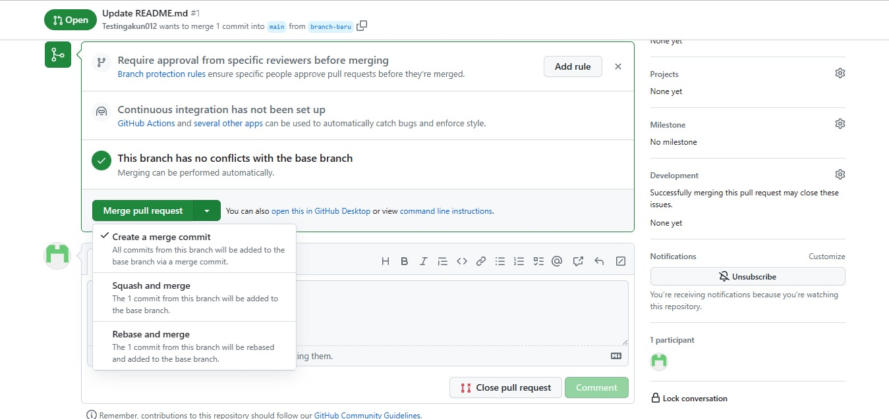

1. Merge 
   
   Membuat `merge commit` yang menyatukan main dengan branch terkait

2. Squash
   
   Menggabungkan beberapa commit pada satu branch menjadi satu commit.

3. Rebase
   
   Menggabungkan dan me-*rewrite* *history* dari commit main sehingga *history* menjadi linear 

Berikut gambaran mengenai merge
