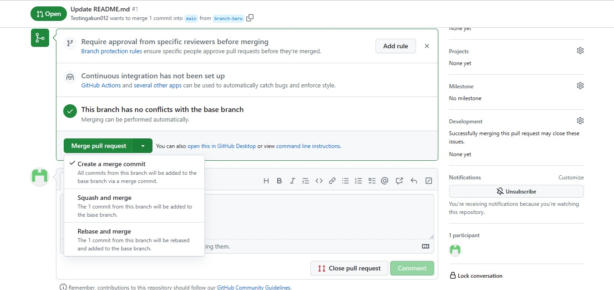

# Memulai Dengan Git Local


## Konfigurasi 

Sebelum kita melakukan commit dan push ke repository, kita harus melakukan konfigurasi terlebih dahulu. Konfigurasi ini hanya dilakukan sekali saja. Dengan tujuan agar git dapat mengenali siapa yang melakukan commit dan push ke repository. Untuk melakukan konfigurasi, kita dapat menggunakan perintah berikut:

```bash
git config --global user.name "Nama Anda"
git config --global user.email "Email Anda"
```
- `git config` adalah perintah untuk melakukan konfigurasi pada git 
- `--global` adalah perintah untuk melakukan konfigurasi secara global, artinya konfigurasi ini akan digunakan untuk semua repository yang ada di komputer kita. Jika tidak menggunakan `--global`, maka konfigurasi hanya akan digunakan untuk repository yang sedang aktif saja.

Untuk Melihat konfigurasi yang telah kita lakukan, kita dapat menggunakan perintah berikut:

```bash
git config --list
```

## Inisialisasi Repository

Setelah melakukan konfigurasi, kita dapat melakukan inisialisasi repository. Inisialisasi repository dilakukan dengan cara menjalankan perintah `git init` pada folder yang akan kita gunakan sebagai repository. 

```bash
git init
```

Perintah tersebut akan membuat sebuah foler `.git` yang berisi object database dari git. Folder `.git` ini yang akan digunakan oleh git untuk melakukan tracking terhadap perubahan yang terjadi pada repository.

## Remote Repository

Remote repository digunakan untuk menghubungkan repository yang berada di local dengan repository yang berada di server. Dengan adanya remote repository, kita dapat melakukan push dan pull dari repository yang berada di server.

Untuk menambahkan remote repository, kita dapat menggunakan perintah berikut:

```bash
git remote add origin <url>
```
- `origin` adalah nama remote repository yang akan kita tambahkan. Nama origin ini tidak baku, kita dapat menggantinya dengan nama lain.

Untuk melihat remote repository yang telah kita tambahkan, kita dapat menggunakan perintah berikut:

```bash
git remote -v
```

> Kita dapat menambahkan lebih dari satu remote repository. 

## Membuat Commit

Setelah melakukan perubahan pada repository, maka perubahan yang kita lakukan terdapat pada working directory. Untuk melakukan commit kita perlu memindahkan perubahan yang ada pada working directory ke staging area.

Untuk memindahkan perubahan yang ada pada working directory ke staging area, kita dapat menggunakan perintah berikut:

```bash
git add .
```
> `.` adalah perintah untuk memindahkan semua perubahan yang ada pada working directory ke staging area. Jika kita ingin memindahkan perubahan yang ada pada satu file saja, kita dapat mengganti `.` dengan nama file yang akan kita pindahkan.


Sebelum kita melakukan commit, pada dasarnya kita harus melakukan pengecekan terlebih dahulu terhadap perubahan yang ada pada staging area. 
Untuk melakukan pengecekan terhadap perubahan yang ada pada staging area, kita dapat menggunakan perintah berikut:

```bash
git status
```

Setelah dirasa perubahan yang ada pada staging area sudah sesuai, kita dapat melakukan commit. Untuk melakukan commit, kita dapat menggunakan perintah berikut:

```bash
git commit -m "pesan commit"
```

Melalui perintah tersebut, kita telah berhasil memindahkan perubahan yang ada pada staging area ke repository. Untuk melihat commit yang telah kita lakukan, kita dapat menggunakan perintah berikut:

```bash
git log
```

Kemudian akan muncul informasi commit yang telah kita lakukan.

```bash
commit 6d0f2d158e20d3b1f32fce655fe9b19f1b6d7386 (HEAD -> main, origin/main)
Author: Robby Pambudi <robby.pambudi10@gmail.com>
Date:   Thu Aug 17 14:47:19 2023 +0700

    initial commit
```

Anda juga dapat menggunakan perintah berikut untuk melihat perubahan yang terjadi pada commit. 

```bash
git log -p -2 # -p (patch) -2 (jumlah commit yang akan ditampilkan) Menampilkan perubahan yang terjadi pada commit

git log --pretty=oneline # Menampilkan informasi commit dalam satu baris
git log --pretty=format:"%h - %an, %ar : %s" # Menampilkan informasi commit dengan format tertentu
```

## Push ke Remote Repository

Setelah melakukan commit, kita dapat melakukan push ke remote repository. Untuk melakukan push, kita dapat menggunakan perintah berikut:

```bash
git push <nama-remote> <nama-branch>
```
- `<nama-remote>` adalah nama remote repository yang akan kita gunakan. Pada contoh ini kita akan menggunakan remote repository dengan nama `origin`.
- `<nama-branch>` adalah nama branch yang akan kita gunakan. Pada contoh ini kita akan menggunakan branch `main`.


## Membuat Branch


Begitulah suasana yang sangat diinginkan oleh para developer, tetapi tidak semua kasus seperti itu. Tapi yang perlu diingat adalah **Conflict Bukan Sebuah Masalah** tapi merupakan sebuah tantangan yang harus diselesaikan.

Back to topic, untuk membuat branch kita dapat menggunakan perintah berikut:

```bash
git branch <nama-branch>
```

Untuk melihat branch yang telah kita buat, kita dapat menggunakan perintah berikut:

```bash
git branch
```
> Note : 
```bash
git branch -a # Melihat semua branch yang ada
git branch -d <nama-branch> # Menghapus branch
git checkout <nama-branch> # Pindah ke branch
```

Akhirnya selesai juga materi tentang git, apakah sudah paham? jika belum paham silahkan baca ulang materi ini dan jangan lupa untuk praktek. Semoga bermanfaat, terimakasih.