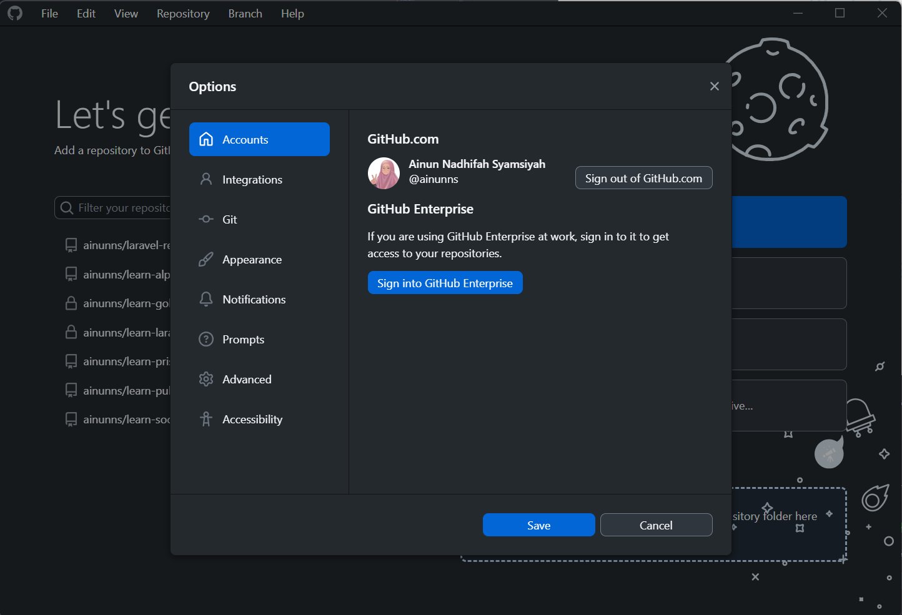
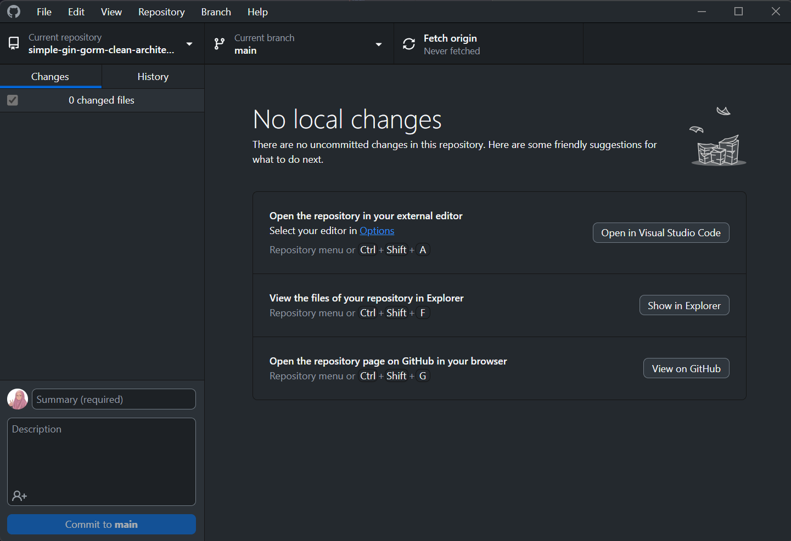
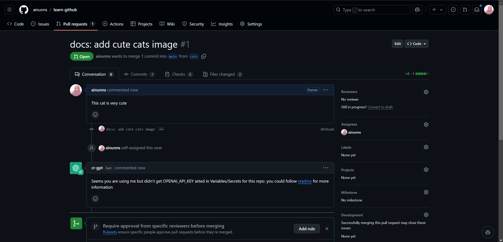
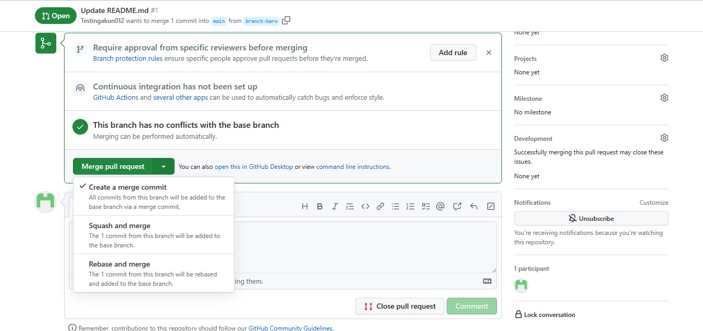

# Simulasi GitHub Dasar

Setelah mempelajari dasar-dasar dari Git dan GitHub, sekarang kita akan mengenal interface GitHub lebih dalam.

## Pembuatan Akun GitHub

1. Pilih `Sign Up` untuk mendaftarkan diri menjadi pengguna baru GitHub

   

2. Isi semua data diri yang diperlukan untuk registrasi seperti email, password dan lain sebagainya

   

3. Selamat! Kamu telah berhasil membuat akun GitHub

> Kamu juga bisa melakukan personalisasi profil akun melalui [Settings](https://github.com/settings/profile)

## GitHub Desktop

### Apa itu GitHub Desktop?

GitHub Desktop adalah aplikasi gratis dan open source yang dirancang untuk membantu programmer berinteraksi dengan kode yang disimpan di GitHub atau layanan hosting Git lainnya. Melalui antarmuka grafis yang ramah pengguna, GitHub Desktop memungkinkan para programmer melakukan berbagai perintah Git seperti commit dan push perubahan tanpa harus menggunakan baris perintah terminal.

GitHub memiliki beberapa fitur utama:

- Interface yang ramah bagi para Pengguna
- Terintegrasi langsung dengan akun GitHub
- Kemudahan manajemen repository tanpa menggunakan terminal
- Support di Windows 10 64-bit keatas dan MacOS 10.15 keatas

> Catatan: Kamu harus memiliki sistem operasi 64-bit agar bisa menjalankan GitHub Desktop

### Instalasi GitHub Desktop

1. Kunjungi laman utama dari [GitHub Desktop](https://github.com/apps/desktop), kemudian klik `Download Now`

   

2. Klik `Download for Windows/MacOS`. Sesuaikan dengan sistem operasi yang kamu punya

   

3. Klik dua kali pada setup file yang telah berhasil didownload.

   

4. Setelah instalasi berhasil, GitHub Desktop akan otomatis terbuka. Tada! GitHub Desktop sudah tersedia di local Anda

   

### Autentikasi pada GitHub

GitHub Desktop terhubung ke GitHub saat Anda melakukan aktivitas seperti pull, push, clone, dan fork repository remote. Untuk terhubung ke GitHub melalui GitHub Desktop, Anda wajib melakukan otentikasi akun terlebih dahulu.

1. Buka GitHub Desktop, kemudian pilih `Sign in to GitHub.com`

   

2. Kemudian Anda akan diarahkan ke halaman untuk memilih akun GitHub yang ingin dihubungkan ke GitHub Desktop

   

3. Setelah akun berhasil terhubung, Anda akan diminta untuk mengonfigurasi Git. Hal ini dilakukan agar Git dapat mengidentifikasi siapa pemilik commit yang telah dibuat. Terdapat dua opsi konfigurasi, yaitu menggunakan nama akun dari GitHub beserta alamat email nya atau konfigurasi secara manual.

   Pada kali ini, kita pilih opsi yang pertama, yaitu menggunakan nama akun dari GitHub beserta email yang terhubung. Kemudian sesuaikan alamat email yang kalian inginkan dan klik `Finish`.

   

4. Selamat! GitHub Desktop Anda telah terautentikasi dengan akun GitHub

   

> Catatan: Anda dapat melakukan personalisasi GitHub Desktop lainnya dengan cara klik `File` > `Options` pada navigasi di atas
>
> 

### Manajemen Repository pada GitHub Desktop

GitHub Desktop menawarkan fleksibilitas pada manajemen repository, mulai dari membuat repository baru di local, menambahkan repository yang sudah ada di local ke GitHub Desktop, maupun clone repository manapun dari internet.

#### 1. Membuat Repository Baru di Local

1. Buka GitHub Desktop, lalu klik `Create a New Repository on your local drive`

   

   > Catatan: Anda juga dapat membuat repository baru melalui `File` > `New Repository` pada navigasi di atas
   >
   > 

2. Kemudian isi nama repository, deskripsi repository, serta atur local path yang diinginkan. Anda bisa menambahkan README.md, .gitignore, maupun License jika memang diperlukan

   

3. Setelah itu, klik `Create Repository` dan voila! Anda berhasil membuat repository baru pada local Anda

   

#### 2. Menambahkan repository yang sudah ada di local ke GitHub Desktop

1. Buka GitHub Desktop lalu klik `Add an Existing Repository from your local drive`

   

   > Catatan: Anda juga dapat menambahkan repository yang sudah ada di local ke GitHub Desktop melalui `File` > `Add local repository` pada navigasi di atas
   >
   > 

2. Kemudian pilih local path dari repository yang kita punya, setelah itu klik `Add Repository`

   

3. Voila! Repository local Anda sudah terhubung dengan GitHub Desktop

   

#### 3. Clone Repository ke GitHub Desktop dari Internet

1. Buka GitHub Desktop lalu klik `Clone a repository from the Internet`

   

   > Catatan: Anda juga dapat menambahkan repository yang sudah ada di local ke GitHub Desktop melalui `File` > `Clone repository` pada navigasi di atas
   >
   > 

2. Pilih clone dari URL, kemudian masukkan URL repository yang ingin diclone ke local. pada kasus ini, kita ingin meng-clone repository https://github.com/Lab-RPL-ITS/simple-gin-gorm-clean-architecture

   

   > Catatan: Anda juga dapat meng-clone repository menggunakan GitHub.com, tetapi hanya repository yang Anda memiliki akses read/write yang dapat diclone jika menggunakan mode ini

3. Tunggu hingga proses cloning selesai dan voila! repository tersebut sudah tersedia di local Anda

   

### Publish Local Repository ke GitHub

Ketika Anda [membuat repository baru](https://github.com/Lab-RPL-ITS/module-pelatihan-vcs/blob/main/Materi_3-Simulasi_GitHub_Dasar.md#1-membuat-repository-baru-di-local), repository ini hanya tersedia di local komputer milik Anda dan hanya Anda yang bisa mengakses repository ini. Anda dapat publish repository manapun ke GitHub agar dapat tersinkronisasi dengan banyak komputer lain dan memungkinkan orang lain untuk mengakses repository tersebut.

Langkah-langkah publish repository melalui GitHub Desktop

1. Pada bar repository, klik `Publish Repository`

   

2. Kemudian lengkapi detail repository yang disediakan

   

   > Catatan:
   >
   > a. GitHub Desktop secara otomatis mengisi kolom "Nama" dan "Deskripsi" dengan informasi yang Anda masukkan saat membuat repository.
   >
   > b. Opsi `Keep this code private` memungkinkan Anda mengontrol siapa yang dapat melihat proyek Anda. Jika Anda tidak memilih opsi ini, pengguna lain di GitHub akan dapat melihat kode Anda. Namun, jika Anda memilih opsi ini, kode Anda tidak akan tersedia secara publik.
   >
   > c. Menu drop-down Organisasi, jika tersedia, memungkinkan Anda mempublikasikan repository ke organisasi tertentu yang Anda ikuti di GitHub.

3. Setelah itu, klik `Publish Repository`. GitHub Repository Anda tersedia di `https://github.com/{username GitHub}/{nama repository}`

   

### Manajemen File melalui GitHub Desktop

#### Membuat Branch

1. Pada bar repository, klik `Current Branch`

   

   > Catatan: Anda juga bisa berpindah ke branch lain melalui menu ini

2. Kemudian klik `New Branch`

   

3. Setelah itu, isikan nama branch yang diinginkan

   

4. Klik `Create branch` dan voila! branch baru telah berhasil dibuat

   

   > Catatan: Anda dapat mem-publish branch baru ini ke remote repository dengan cara klik `Publish Branch` pada bar repository

#### Melakukan Commit Changes

1. Lakukan perubahan terlebih dahulu pada repository
2. Buka GitHub Desktop, Anda dapat melihat seluruh perubahan yang Anda lakukan

   

3. Kemudian tambahkan summary dan description (opsional) pada sidebar kiri bawah. Summary akan menjadi message dari commit yang akan dibuat.

   

4. Klik `Commit to {nama branch}`. Changes berhasil dicommit

   

   > Catatan: Anda dapat melihat kembali perubahan apa saja yang sudah Anda lakukan melalui menu `History`

#### Melakukan Push ke Remote Repository

1. Pada bar repository, klik `Push Origin`

   

2. Tunggu hingga proses push selesai, dan voila! commit changes kita telah berhasil tersedia di GitHub.

   

#### Membuat Pull Request ke Branch Lain

1. Klik `Preview Pull Request`. GitHub Desktop akan membuka dialog pratinjau yang menampilkan diff antara branch saat ini dengan base branch.

   

2. Pastikan branch di menu dropdown `base` yang merupakan branch tempat Anda ingin merge perubahan Anda. Kemudian klik `Create pull request`

   

3. Anda akan diarahkan ke GitHub untuk membuat pull request. Anda dapat mengisi title, description, reviewers, assignees, labels, projects, milestone, maupun development jika memang dibutuhkan. Tetapi yang paling utama adalah title.

   

4. Klik `Create pull request`. Voila! Pull request telah berhasil dibuat

   

   > Catatan: Anda dapat membuat melihat seluruh pull requests yang telah dibuat pada bar repository, klik `Pull request`
   >
   > 

## GitHub Website

### Membuat Repository

1. Klik tanda `+`
   

2. Pilih `New Repository`
   

3. Isi kelengkapan repository seperti nama repository, deskripsi, sifat repository (public/private), penambahan README.md dan lain sebagainya
   

4. Selamat ! Kamu telah berhasil membuat repository pertamamu !
   

### Manajemen File

Pada GitHub, kita dapat memanejemensi file yang ada dengan berbagai fitur, berikut fitur-fitur yang ada pada GitHub

#### Memasukkan File dari GitHub

Kita dapat memasukkan file dengan dua cara

1. Cara Pertama adalah dengan membuat file barunya secara langsung
   

2. Cara Kedua adalah dengan meng-_upload_ file
   

#### Melakukan Commit

Setelah file yang diinginkan sudah ditambahkan, file dapat dicommit.

1. Commit pada cara pertama
   

2. Commit pada cara kedua
   

Pada tiap cara di atas, terdapat bagian commit seperti judul dan deskripsi (A) serta pilihan tipe commit (B). Pada pilihan tipe commit, terdapat dua pilihan, langsung menggabungkan ke main atau dicommit menuju branch lain terlebih dahulu. Branch akan dijelaskan di bagian selanjutnya pada materi ini.

Jika file telah dipermanen di github, maka anda dapat melihat judul commit anda pada bagian ini

#### Mengedit File

Jika ditemui kesalahan pada file yang telah dicommit, file dapat diedit supaya revisi dapat dilakukan.

Hasil dari file yang telah diedit kemudian dicommit kembali agar hasilnya dapat permanen di github.

#### Membuat Branch

Branch dapat dibuat dengan berbagai cara, berikut beberapa cara-cara pembuatan branch

1. Langsung dari halaman utama repository
   
2. Melalui create new file
   
3. Melalui upload file
   

Branch sendiri berguna sebagai sarana pengembangan fitur maupun perubahan pada lingkungan yang berbeda dari main sehingga perubahan yang kita lakukan tidak akan mengganggu main maupun mengganggu orang lain yang juga sedang bekerja pada projek yang sama

#### Melakukan Pull Request

Pull Request merupakan fitur pada GitHub yang membantu _developer_ untuk memberitakan bahwa telah dibuat perubahan dan _contributor_ lain dapat melakukan review terhadap perubahan-perubahan tersebut sebelum dilakukan Merge ke main

berikut tampilan Pull Request,

Tampilan ketika branch siap di Pull Request (Ada Perubahan)

Tampilan ketika branch akan di Pull Request, terdapat berbagai kelengkapan seperti judul dan deskripsi yang dapat diisi.

Tampilan Pull Request ketika telah dibuat

#### Melakukan Merge

Ketika Pull Request telah selesai di-_review_ maka saatnya melakukan merge terhadap branch. Berikut tiga macam merge yang tersedia

1. Merge

   Membuat `merge commit` yang menyatukan main dengan branch terkait

2. Squash

   Menggabungkan beberapa commit pada satu branch menjadi satu commit.

3. Rebase

   Menggabungkan dan me-_rewrite_ _history_ dari commit main sehingga _history_ menjadi linear

Berikut gambaran mengenai merge

## Extras

### Conventional Commit

Conventional Commit adalah cara penulisan pesan commit yang banyak digunakan oleh para _developer_. Berikut contohnya,

- `feat` Commits, menambahkan fitur baru
- `fix` Commits, memperbaiki bug
- `style` Commits, menambahan perubahan yang tidak berefek terhadap arti dari kode
- `test` Commits, menambahkan test yang belum dibuat maupun memperbaiki test yang telah ada sebelumnya

Selengkapnya dapat dilihat pada

https://www.droidcon.com/2023/03/03/code-commit-guidelines-using-conventional-commits
