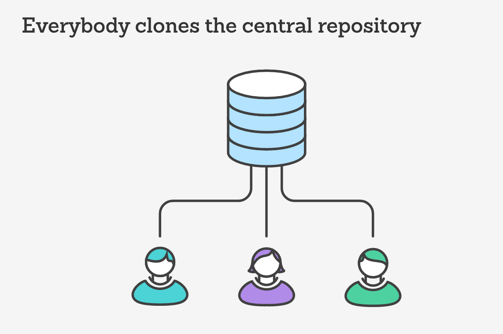
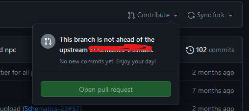
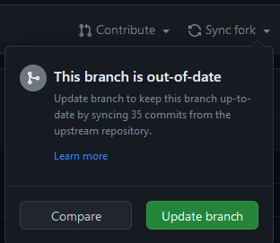

# Berkolaborasi dengan GIT

ada 2 cara untuk berkolaborasi dengan git yaitu dengan cara fork dan clone

## Fork
Fork adalah cara untuk berkontribusi pada sebuah repository yang dimiliki oleh orang lain. Dengan melakukan fork, kita akan memiliki repository yang sama persis dengan repository orang lain. Perubahan yang dilakukan pada repository hasil fork tidak akan mempengaruhi repository aslinya.

Untuk melakukan fork, kita dapat menggunakan tombol fork yang ada pada repository orang lain.

Setelah melakukan fork, kita akan memiliki repository yang sama persis dengan repository orang lain. Repository tersebut akan berada pada akun kita.

### Contribute
Untuk melakukan contribusi antara repository yang ada pada akun kita dengan repository aslinya, kita dapat melakukan pull request. Untuk melakukan pull request, kita dapat menggunakan tombol contribute yang ada pada repository hasil fork. Setelah itu, kita dapat memilih open pull request.

* Case diatas kita belum melakukan perubahan apapun pada repository hasil fork.

### Sync Fork
Sedangkan untuk melakukan sinkronisasi antara repository hasil fork dengan repository aslinya, kita dapat menggunakan tombol sync yang ada pada repository hasil fork. Setelah itu, kita dapat memilih fetch upstream.

Dan kita dapat menekan tombol update branch untuk melakukan sinkronisasi.

## Clone
Clone adalah cara untuk berkontribusi pada sebuah repository yang dimiliki oleh orang lain. Dengan melakukan clone, kita akan memiliki repository yang sama persis dengan repository orang lain. Perubahan yang dilakukan pada repository hasil clone akan mempengaruhi repository aslinya. 

Namun yang menjadi perbedaan besar antara clone dan fork adalah kita perlu diundang terlebih dahulu oleh pemilik repository untuk dapat melakukan perubahan pada repository aslinya.

## Conflict
Conflict terjadi ketika terdapat perubahan yang dilakukan pada baris yang sama pada file yang sama. Conflict dapat terjadi ketika kita melakukan merge atau pull request.

Langsung saja kita simulasikan conflict.